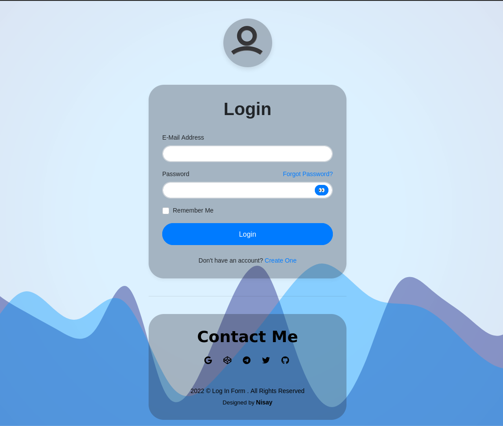
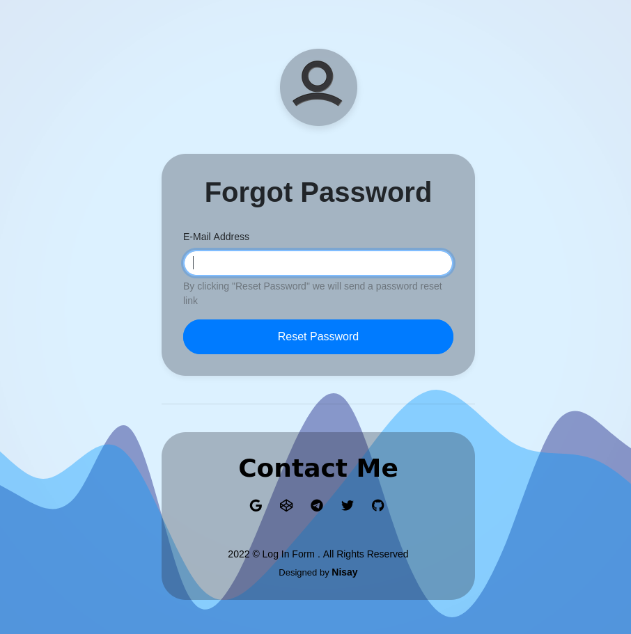
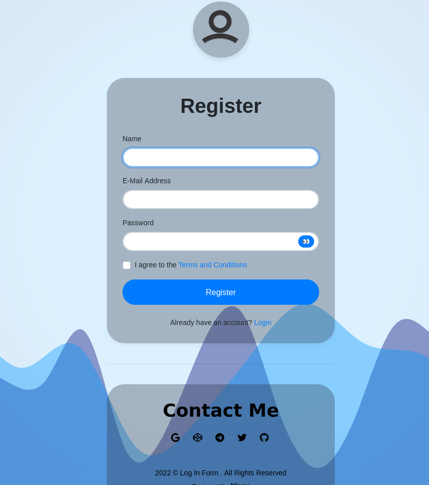

# Bootstrap 5 Login Page

This is a Bootstrap 5 Login Page template, you can use it as you wish and it's free for personal or commercial use.

# Installation
Let's make it easy! Just download this template, use it on your project.

# Demo
- [Login](https://YasinDehfuli.github.io/Login-Page/index.html)
- [Register](https://YasinDehfuli.github.io/Login-Page/Register.html)
- [Forgot Password](https://YasinDehfuli.github.io/Login-Page/Forget.html)

# Features
- Bootstrap 4.3 
- Bootstrap 4.3 Validation
- Verified by W3C
- 3 Pages included (Login, Register, Forgot Password)
- No custom classes
- Easy to use
- Cross-browser compatibility (Chrome, Firefox, Opera, IE11, Safari)
- Fully responsive
- and more ...

# Report Some Bugs
Find a Bug? Please, [create an issue](https://github.com/YasinDehfuli/Login-Page/issues) and we'll fix it together for a better template.

# Contribution
Contribution are always welcome and recommended! Here is how:

- Fork the repository ([here is the guide](https://help.github.com/articles/fork-a-repo/)).
- Clone to your machine git clone https://github.com/YOUR_USERNAME/Login-Page.git
- Make your changes
- Create a pull request

# License
[GNU License](http://opensource.org/licenses/GNU)

---

Have a good day! ❤️
